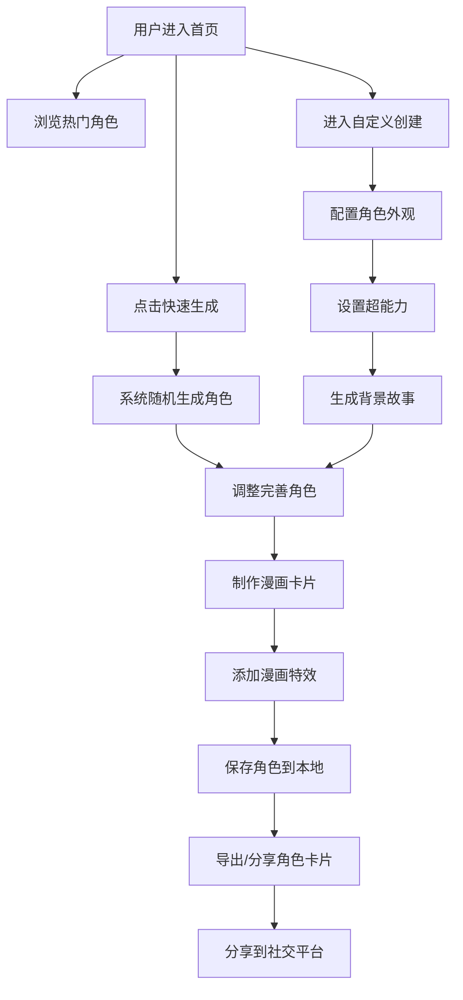

## 1. 产品概述

复古美式漫画风格的超级英雄角色生成器，为漫画爱好者和创意人士提供一个充满趣味性的角色创作工具。用户可以随机生成或自定义超级英雄的外观、超能力和背景故事，并制作精美的漫画风格卡片进行保存和分享。

- 主要用途：创意娱乐、角色设计灵感、社交分享
- 目标用户：漫画爱好者、游戏玩家、创意设计师、社交媒体用户
- 产品价值：将复古美式漫画美学与互动式角色生成结合，提供独特而有趣的创作体验

## 2. 核心特性

### 2.1 用户角色

| 角色 | 注册方式 | 核心权限 |
|------|----------|----------|
| 普通用户 | 无需注册，本地存储 | 生成角色、自定义角色、保存角色、分享角色、浏览热门角色 |

### 2.2 功能模块

1. **首页**：英雄展示区、快速生成入口、热门角色展示、导航菜单
2. **角色生成器**：随机生成、外观自定义、能力配置、背景故事生成
3. **漫画卡片制作**：卡片样式选择、布局调整、特效添加、导出下载
4. **角色收藏**：已保存角色列表、角色详情查看、角色管理
5. **热门角色**：社区热门角色展示、角色点赞、模板应用

### 2.3 页面详情

| 页面名称 | 模块名称 | 功能描述 |
|----------|----------|----------|
| 首页 | 英雄展示区 | 动态展示随机生成的超级英雄，带漫画风格动画效果 |
| 首页 | 快速操作区 | 一键随机生成、开始自定义创作两个主要入口按钮 |
| 首页 | 热门角色墙 | 网格布局展示热门角色卡片，支持滚动浏览 |
| 角色生成器 | 随机生成模块 | 点击骰子按钮一键生成完整角色，带加载动画 |
| 角色生成器 | 外观编辑器 | 头像、服装、配色、配饰等外观元素自定义 |
| 角色生成器 | 能力配置器 | 超能力选择、能力值分配、弱点设定 |
| 角色生成器 | 故事生成器 | AI 风格背景故事生成，支持编辑和重新生成 |
| 漫画卡片制作 | 模板选择 | 多种复古漫画卡片模板供选择 |
| 漫画卡片制作 | 特效编辑 | 爆炸效果、对话框、网点纸等漫画元素添加 |
| 漫画卡片制作 | 导出功能 | PNG 图片下载、分享链接生成 |
| 角色收藏 | 角色列表 | 卡片式展示已保存的角色，支持搜索和筛选 |
| 角色收藏 | 角色详情 | 完整查看角色信息，支持编辑和删除 |
| 热门角色 | 角色展示 | 展示用户分享的热门角色，按热度排序 |
| 热门角色 | 互动功能 | 点赞、使用模板创建相似角色 |

## 3. 核心流程

用户进入首页后可以选择快速随机生成或进入详细的自定义创建流程。生成角色后可以调整完善，制作漫画卡片，添加各种漫画风格的视觉特效，最终保存并分享。

## 4. 用户界面设计

### 4.1 设计风格

- **主色调**：鲜艳的红色（#E53935）、经典蓝色（#1565C0）、明黄（#FDD835）、深黑色（#212121）
- **辅助色**：网点灰（#757575）、纸张白（#FAFAFA）、墨水蓝（#0D47A1）
- **按钮风格**：粗黑边框、3D 立体效果、悬停时有漫画爆炸动画
- **字体**：
  - 标题：Bangers 或类似复古漫画字体
  - 正文：Roboto Slab 或清晰易读的衬线字体
  - 对话框：Comic Neue 或经典手写漫画字体
- **布局风格**：不对称网格布局、重叠卡片设计、斜切边缘、粗黑描边
- **视觉元素**：网点纸纹理、爆炸效果、速度线、对话框、拟声词（POW! BAM!）

### 4.2 页面设计概述

| 页面名称 | 模块名称 | UI 元素 |
|----------|----------|----------|
| 首页 | 英雄展示区 | 大型漫画风格角色立绘、动态对话框、悬浮动画、渐变背景带网点纹理 |
| 首页 | 快速操作区 | 大尺寸立体按钮、爆炸效果悬停动画、粗黑描边 |
| 首页 | 热门角色墙 | 倾斜卡片网格、滚动动画、悬停放大效果 |
| 角色生成器 | 外观编辑器 | 侧边栏选项卡、实时预览区、颜色选择器带漫画色块、滑块带粗边设计 |
| 角色生成器 | 能力配置器 | 雷达图能力值展示、超能力徽章、拖动分配交互 |
| 角色生成器 | 故事生成器 | 漫画对话框样式文本框、打字机效果、重新生成按钮带闪电图标 |
| 漫画卡片制作 | 模板选择 | 卡片缩略图网格、选中态粗红边框、预览区 |
| 漫画卡片制作 | 特效编辑 | 可拖拽特效元素、爆炸贴纸、对话框组件、网点纸叠加层 |
| 角色收藏 | 角色列表 | 瀑布流布局、卡片翻转效果、搜索框带放大镜图标 |
| 热门角色 | 角色展示 | 热度排名徽章、点赞按钮带心跳动画、模板复制按钮 |

### 4.3 响应式设计

- **桌面优先**：1440px 为设计基准，充分利用宽屏展示丰富内容
- **平板适配**：1024px 断点，调整网格列数，侧边栏可折叠
- **手机适配**：768px 断点，单列布局，底部导航，优化触摸交互
- **触摸优化**：按钮最小尺寸 44x44px，增加手势操作支持

### 4.4 动效设计

- **页面加载**：漫画分镜式渐入，元素从四周飞入
- **按钮交互**：悬停时有轻微放大和抖动，点击有爆炸粒子效果
- **角色生成**：骰子旋转动画，生成时多条速度线闪过，角色逐渐清晰
- **卡片翻转**：3D 翻转效果展示角色正反两面
- **对话框**：出现时有弹跳动画，模拟漫画气泡弹出效果
- **滚动视差**：背景网点纸与前景元素不同速度滚动，增加层次感
