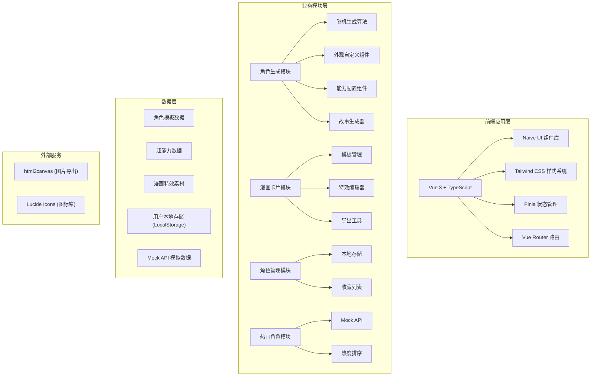
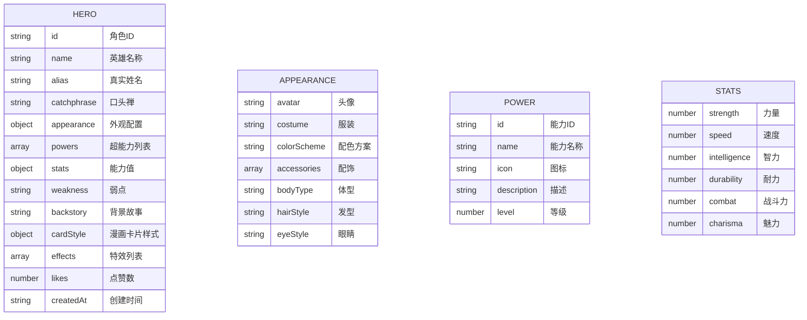

## 1. 架构设计



## 2. 技术说明

### 2.1 技术栈选择说明

**重要技术决策**：用户需求中提到的「Svelte + Naive UI」组合存在技术冲突。Naive UI 是 Vue 3 专属的组件库，仅支持 Vue 3 框架，无法在 Svelte 中使用。因此本项目采用 **Vue 3 + Naive UI** 技术栈，以确保 Naive UI 组件库能正常工作。

- **前端框架**：Vue 3 + TypeScript + Vite
- **UI 组件库**：Naive UI（Vue 3 专属，提供丰富的组件支持）
- **样式方案**：Tailwind CSS 3 + 自定义 CSS 变量
- **状态管理**：Pinia（Vue 3 官方推荐）
- **路由管理**：Vue Router 4
- **图标库**：Lucide Vue Next
- **图片导出**：html2canvas
- **数据方案**：Mock API + LocalStorage 本地存储

### 2.2 项目初始化

- **初始化工具**：Vite
- **初始化命令**（Windows 环境）：
  ```
  npm init vite-init@latest -y . "--" --template vue-ts --force
  ```

## 3. 路由定义

| 路由路径 | 页面名称 | 用途说明 |
|----------|----------|----------|
| `/` | 首页 | 英雄展示、快速入口、热门角色展示 |
| `/generator` | 角色生成器 | 随机生成、自定义外观、能力配置、故事生成 |
| `/card-maker` | 漫画卡片制作 | 卡片模板选择、特效编辑、导出下载 |
| `/collection` | 角色收藏 | 已保存角色列表、角色详情、管理功能 |
| `/hot` | 热门角色 | 热门角色展示、互动功能 |

## 4. 数据模型

### 4.1 角色数据模型



### 4.2 TypeScript 类型定义

```typescript
// 角色外观
interface Appearance {
  avatar: string;
  costume: string;
  colorScheme: string;
  accessories: string[];
  bodyType: string;
  hairStyle: string;
  eyeStyle: string;
}

// 超能力
interface Power {
  id: string;
  name: string;
  icon: string;
  description: string;
  level: number;
}

// 能力值
interface Stats {
  strength: number;
  speed: number;
  intelligence: number;
  durability: number;
  combat: number;
  charisma: number;
}

// 漫画特效
interface ComicEffect {
  id: string;
  type: 'explosion' | 'speech_bubble' | 'sound_effect' | 'speed_lines' | 'halftone';
  x: number;
  y: number;
  rotation: number;
  scale: number;
  content?: string;
  style?: string;
}

// 超级英雄
interface Hero {
  id: string;
  name: string;
  alias: string;
  catchphrase: string;
  appearance: Appearance;
  powers: Power[];
  stats: Stats;
  weakness: string;
  backstory: string;
  cardTemplate: string;
  effects: ComicEffect[];
  likes: number;
  createdAt: string;
}

// 卡片模板
interface CardTemplate {
  id: string;
  name: string;
  thumbnail: string;
  layout: 'classic' | 'modern' | 'vintage' | 'action';
  borderStyle: string;
  backgroundColor: string;
  titlePosition: 'top' | 'bottom' | 'overlay';
}
```

## 5. Mock API 定义

### 5.1 获取角色模板列表

```typescript
// GET /api/templates
interface GetTemplatesResponse {
  code: number;
  message: string;
  data: Hero[];
}
```

### 5.2 获取热门角色列表

```typescript
// GET /api/hot-heroes
interface GetHotHeroesResponse {
  code: number;
  message: string;
  data: Array<Hero & { rank: number }>;
}
```

### 5.3 点赞角色

```typescript
// POST /api/heroes/:id/like
interface LikeHeroResponse {
  code: number;
  message: string;
  data: { likes: number };
}
```

### 5.4 获取超能力列表

```typescript
// GET /api/powers
interface GetPowersResponse {
  code: number;
  message: string;
  data: Power[];
}
```

### 5.5 获取卡片模板列表

```typescript
// GET /api/card-templates
interface GetCardTemplatesResponse {
  code: number;
  message: string;
  data: CardTemplate[];
}
```

## 6. 项目结构

```
d:\lhd041\
├── .trae\
│   └── documents\
│       ├── 产品需求文档.md
│       └── 技术架构文档.md
├── src\
│   ├── components\          # 可复用组件
│   │   ├── common\         # 通用组件（按钮、对话框等）
│   │   ├── hero\           # 英雄相关组件
│   │   ├── card\           # 漫画卡片组件
│   │   └── comic\          # 漫画特效组件
│   ├── pages\              # 页面组件
│   │   ├── Home.vue
│   │   ├── Generator.vue
│   │   ├── CardMaker.vue
│   │   ├── Collection.vue
│   │   └── HotHeroes.vue
│   ├── stores\             # Pinia 状态管理
│   │   ├── hero.ts        # 英雄数据状态
│   │   └── ui.ts          # UI 状态
│   ├── composables\        # 组合式函数
│   │   ├── useHeroGenerator.ts
│   │   ├── useCardExport.ts
│   │   └── useLocalStorage.ts
│   ├── utils\              # 工具函数
│   │   ├── mockApi.ts
│   │   ├── random.ts
│   │   └── storyGenerator.ts
│   ├── data\               # 静态数据
│   │   ├── heroTemplates.ts
│   │   ├── powers.ts
│   │   ├── cardTemplates.ts
│   │   └── backstories.ts
│   ├── types\              # TypeScript 类型定义
│   │   └── index.ts
│   ├── router\             # 路由配置
│   │   └── index.ts
│   ├── App.vue
│   ├── main.ts
│   └── styles\             # 全局样式
│       ├── main.css
│       ├── comic.css       # 漫画风格样式
│       └── variables.css   # CSS 变量
├── public\                 # 静态资源
│   └── images\
│       ├── avatars\
│       ├── effects\
│       └── templates\
├── index.html
├── package.json
├── vite.config.ts
├── tsconfig.json
├── tailwind.config.js
└── postcss.config.js
```

## 7. 核心模块技术方案

### 7.1 随机生成算法

- 采用加权随机算法，确保稀有属性出现概率合理
- 外观属性组合校验，避免不搭配的组合
- 能力值总和控制，确保角色平衡性
- 背景故事模板填充，结合角色属性生成个性化故事

### 7.2 漫画卡片导出

- 使用 html2canvas 将 DOM 节点渲染为 Canvas
- 支持高清导出（2x/3x 分辨率）
- 处理跨域图片加载问题
- 添加下载文件名自定义

### 7.3 本地存储方案

- 使用 LocalStorage 存储用户创建的角色
- 设计合理的数据结构，支持快速检索
- 添加数据版本管理，便于后续升级
- 存储容量监控，超出限制时提示用户

### 7.4 动画实现方案

- 主要使用 CSS 动画和过渡
- 复杂动画结合 Vue Transition 组件
- 粒子效果使用 Canvas 实现
- 确保动画性能，避免过度动画导致的卡顿
